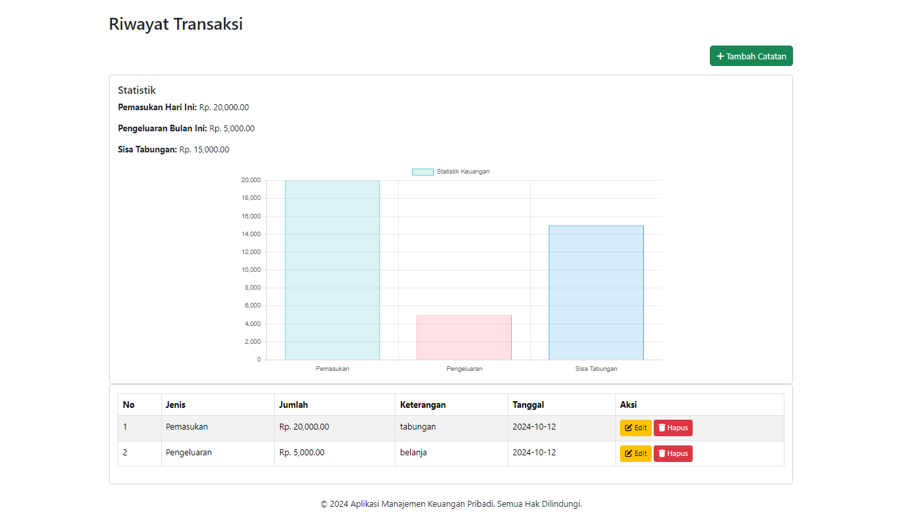

# Aplikasi Manajemen Keuangan Pribadi

## Deskripsi

Aplikasi **Manajemen Keuangan Pribadi** ini dibuat untuk membantu pengguna dalam mengelola pemasukan dan pengeluaran sehari-hari. Aplikasi ini mendukung fitur **CRUD (Create, Read, Update, Delete)** transaksi keuangan, menampilkan statistik keuangan harian dan bulanan, serta menyajikan grafik pemasukan dan pengeluaran dengan **Chart.js**.

## Fitur

1. **Tambah Transaksi**: Pemasukan dan pengeluaran dapat ditambahkan ke dalam aplikasi.
2. **Edit dan Hapus Transaksi**: Pengguna dapat mengedit atau menghapus transaksi yang telah dibuat.
3. **Statistik Keuangan**:
   - Total pemasukan hari ini.
   - Total pengeluaran bulan ini.
   - Grafik statistik pemasukan dan pengeluaran.
4. **Laporan Sisa Tabungan**: Menampilkan jumlah sisa keuangan yang dimiliki berdasarkan total pemasukan dikurangi total pengeluaran.
5. **Grafik Keuangan**: Menggunakan **Chart.js** untuk menampilkan grafik pemasukan dan pengeluaran bulanan.

## Teknologi yang Digunakan

- **PHP Native**: Untuk backend dan pengelolaan data.
- **MySQL**: Sebagai database untuk menyimpan transaksi.
- **Bootstrap**: Framework CSS untuk desain responsif dan modern.
- **Chart.js**: Untuk menampilkan data statistik keuangan dalam bentuk grafik.
- **Font Awesome**: Untuk ikon-ikon yang digunakan pada tombol dan elemen UI lainnya.

## Persyaratan Sistem

- **XAMPP/LAMP** atau web server dengan dukungan **PHP** dan **MySQL**.
- Web browser modern untuk menampilkan tampilan aplikasi.

## Instalasi

### 1. Clone Repository

Clone repository ini atau unduh file zip-nya.

```bash
git clone https://github.com/hasbialwikusmana/Manajemen_Keuangan.git
```

### 2. Konfigurasi Database

- Buat database baru di **phpMyAdmin** atau terminal MySQL dengan nama `db_keuangan`:
  ```sql
  CREATE DATABASE db_keuangan;
  ```
- Import file **db_keuangan.sql** yang disertakan dalam repository ini ke database **db_keuangan**.

### 3. Pengaturan Koneksi Database

- Buka file **config/db.php** dan sesuaikan pengaturan koneksi database sesuai dengan konfigurasi server lokal Anda:
  ```php
  $host = 'localhost';
  $user = 'root';
  $pass = '';
  $db = 'db_keuangan';
  ```

### 4. Jalankan Aplikasi

- Akses aplikasi melalui browser dengan URL:
  ```
  http://localhost/manajemen_keuangan/
  ```

## Struktur Folder

```
├── config/
│   └── db.php            # File koneksi database
├── screenshot/           # File gambar
├── db_keuangan.sql       # Database aplikasi
├── index.php             # Halaman utama aplikasi
├── tambah_catatan.php    # Halaman untuk menambah transaksi
├── ubah_catatan.php      # Halaman untuk mengedit transaksi
├── process_catatan.php   # Proses untuk tambah, edit, dan hapus transaksi
└── README.md             # Dokumentasi aplikasi
```

## Screenshot

<p align="center" style="display: flex; flex-direction: column; align-items: center;">

<table width="100%" style="table-layout: auto;">
   <tr>
    <td colspan="2">
      
    </td>
  </tr>
  <tr>
    <td colspan="2" align="center" style="padding: 10px 0;"><strong>Transaksi Catatan</strong></td>
  </tr>
  <tr>
    <td width="50%" style="vertical-align: top;">
      
    </td>
    <td width="50%" style="vertical-align: top;">
      
    </td>
  </tr>
  <tr>
    <td align="center" style="padding: 10px 0;"><strong>Tambah Catatan</strong></td>
    <td align="center" style="padding: 10px 0;"><strong>Edit Catatan</strong></td>
  </tr>
  </table>
  </p>

## Penggunaan Aplikasi

### 1. Menambah Transaksi

- Akses halaman tambah transaksi dengan menekan tombol **Tambah Catatan** di halaman utama.
- Isi form dengan jenis transaksi (Pemasukan atau Pengeluaran), jumlah, keterangan, dan tanggal transaksi.
- Tekan **Simpan** untuk menyimpan transaksi.

### 2. Mengedit atau Menghapus Transaksi

- Di halaman utama, pada tabel riwayat transaksi, klik tombol **Edit** untuk mengubah detail transaksi.
- Klik tombol **Hapus** untuk menghapus transaksi.

### 3. Melihat Statistik

- Statistik pemasukan hari ini dan pengeluaran bulan ini akan ditampilkan di bagian atas halaman utama.
- Grafik pemasukan dan pengeluaran bulanan ditampilkan di bagian statistik keuangan.

## Contoh Query Database

Berikut adalah contoh query SQL yang digunakan dalam aplikasi ini:

- **Total Pemasukan Hari Ini**:

  ```sql
  SELECT SUM(jumlah) AS total FROM transaksi WHERE jenis='Pemasukan' AND DATE(tanggal) = CURDATE();
  ```

- **Total Pengeluaran Bulan Ini**:

  ```sql
  SELECT SUM(jumlah) AS total FROM transaksi WHERE jenis='Pengeluaran' AND MONTH(tanggal) = MONTH(CURRENT_DATE()) AND YEAR(tanggal) = YEAR(CURRENT_DATE());
  ```

- **Total Sisa Keuangan**:
  ```sql
  SELECT (SELECT SUM(jumlah) FROM transaksi WHERE jenis='Pemasukan') - (SELECT SUM(jumlah) FROM transaksi WHERE jenis='Pengeluaran') AS sisa_keuangan;
  ```

## Kontribusi

Jika Anda ingin berkontribusi pada pengembangan aplikasi ini, silakan fork repository ini, buat branch baru, dan buat pull request.

## Lisensi

Aplikasi ini dilisensikan di bawah **MIT License**. Silakan lihat file [LICENSE](LICENSE) untuk detail lebih lanjut.
